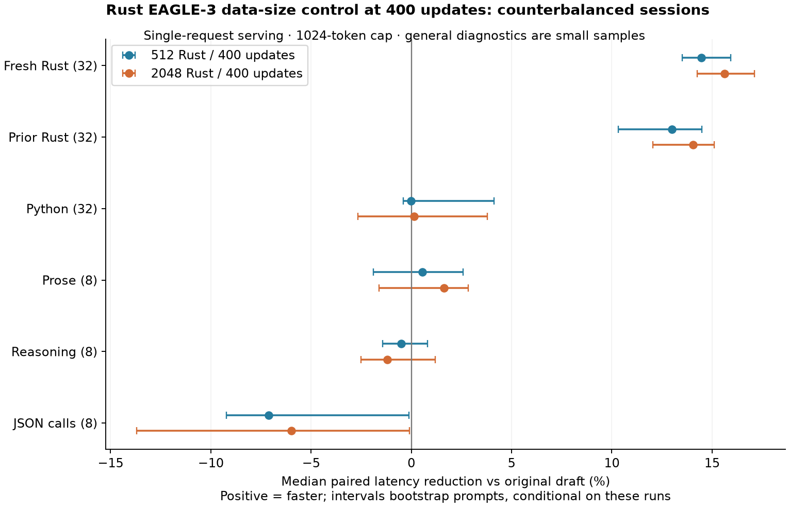
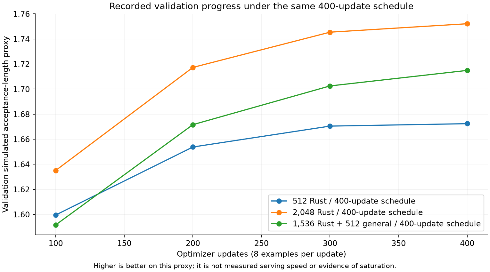
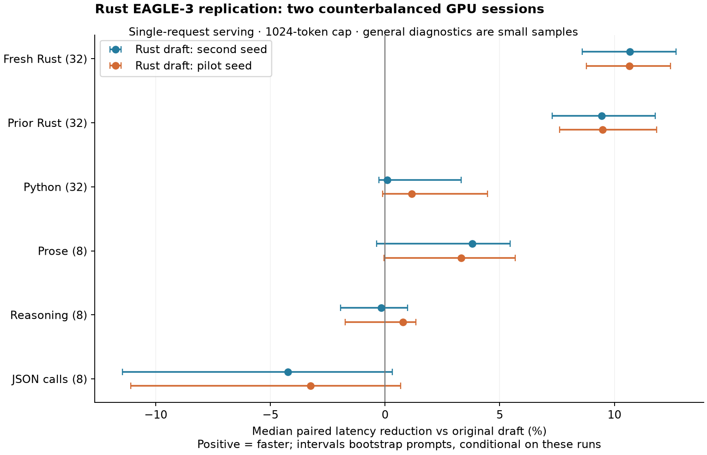
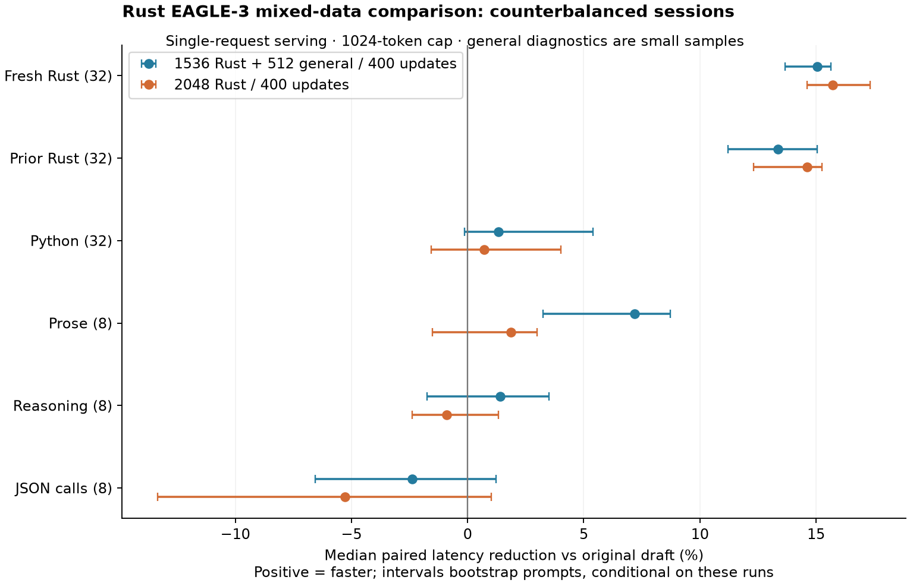

# Making an EAGLE-3 draft faster at Rust

**Rohan Sehgal · September 19, 2026**

A small adaptation of an existing EAGLE-3 draft reduced single-request Rust generation latency by **15.63% relative to the original draft** in the matched-control study, with an exploratory 95% prompt-bootstrap interval of **14.26–17.11%**. The target, Qwen3-8B, stayed frozen. The result concerns serving speed on a small synthetic workload, not improved code quality.

The more interesting finding was how we got there. The initial 512-example adaptation replicated at about 10.7% across two training seeds and two fresh serving sessions. Expanding the pool to 2,048 examples barely helped at 100 updates. Training for 400 updates helped much more. At that larger budget, the direct advantage of 2,048 over 512 examples was **1.76%** (0.40–2.84%). Rust specialization also slowed a small JSON-call diagnostic. A mixed-data draft improved prose relative to the Rust-only draft, at a small cost to Rust; it did not demonstrate a JSON repair.

*Positive latency reduction means faster. Every comparison uses its own same-session baseline. Intervals describe prompt resampling conditional on these checkpoints and sessions.*

## The question

An inference-engineering project should separate the value of an existing method from the value of a modification. EAGLE-3 already accelerates Qwen. This experiment asks whether adapting an existing draft to a narrow workload can improve it further, whether that gain repeats, and what happens as data and optimization budgets change.

Rust is a useful bounded workload because generating functions requires many successive tokens, and speculative decoding can verify several proposed tokens together. We used mostly complete-function generation, not a representative stream of IDE edits. The initial 512 prompts were a feasibility choice under a small compute budget, not a statistical power calculation or a claim that Rust adaptation saturates there.

## What EAGLE-3 is doing here

Speculative decoding lets a cheap draft propose future tokens and a more expensive target verify them. A useful draft predicts what the target would emit cheaply enough that accepting several tokens saves more work than drafting and verification add.

[EAGLE-3](https://arxiv.org/abs/2503.01840) is a form of speculative decoding. It uses target-model hidden features as input to its drafter. In this pinned Qwen implementation, the target exposes 4,096-dimensional vectors from zero-based layers 1, 17, and 32. Concatenating them produces 12,288 numbers per token; a learned projection maps that back to 4,096. The draft then uses a single transformer block. The target has 36 blocks.

That same vector width does not make the draft as expensive or capable as the target: the draft performs far fewer transformations. Those activation vectors are temporary inputs, not compressed copies of Qwen's weights. This experiment uses BF16; it is **not quantization**. The exported draft stores 399,523,840 parameters excluding vocabulary buffers, uses the target embedding, and is not a standalone coding model.

We warm-started [Tengyunw/qwen3_8b_eagle3](https://huggingface.co/Tengyunw/qwen3_8b_eagle3), preserved its 32,000-entry draft vocabulary mapping, and trained only the draft. Qwen's responses supplied the training targets; its intermediate states supplied the features. The target still verifies draft proposals during serving. Training a better Rust drafter changes how efficiently we reach Qwen's answers, not Qwen's underlying ability to write Rust.

The architecture, pretrained draft, serving engine, and training framework are upstream work. The contribution here is a controlled adaptation, the surrounding capture/export/benchmark pipeline, and an evidence-backed account of where it helps and where it does not.

## Data and training

The pinned Rust source is [Fortytwo-Network/Strandset-Rust-v1](https://huggingface.co/datasets/Fortytwo-Network/Strandset-Rust-v1), a synthetic dataset. Crates were assigned to disjoint train, validation, and held-out splits. We kept 64 validation and 128 held-out prompts fixed while expanding the training pool. The larger pool retains the original 512 as an unchanged prefix. It contains 2,041 function-generation and seven completion prompts, spanning 890 training crates. Exact prompt deduplication does not establish semantic decontamination.

We generated new answers with frozen Qwen3-8B, thinking disabled, and captured target features offline. The original pool has 108,939 teacher answer tokens; the full 2,048-example pool has 438,851. Five and 28 capped answers respectively were kept as prefixes without inventing endings. We did not train on the source's reference solutions. Python evaluation prompts come from [HumanEvalPack](https://huggingface.co/datasets/bigcode/humanevalpack); no compiler or functional pass-rate evaluation was run.

The mixed condition has 1,536 Rust and 512 general prompts. General instructions/context come from [Databricks Dolly 15k](https://huggingface.co/datasets/databricks/databricks-dolly-15k), 64 examples from each of eight categories; answers were regenerated with Qwen. General examples are 25% of the mixture but 40.5% of its distinct teacher answer tokens. This is not a tool-call-specific training set. Dataset sources, fixed revisions, and redistribution notices accompany the release.

All runs start from the same upstream draft, use BF16, one-example microbatches, eight-step accumulation, peak learning rate 1e-5, gradient clipping at 0.5, and EAGLE-3 training length seven. The cosine learning-rate horizon matches the 100- or 400-update budget. A separate Rust validation proxy, simulated acceptance length, selects the checkpoint; test timing does not. All listed candidates selected their final update. The 400-update runs resume full training state at update 200, including optimizer, scheduler, RNG, and data position.

| Candidate | Pool | Updates | Seed | Example exposures | Unique examples seen | Teacher answer-token exposures |
|---|---|---:|---:|---:|---:|---:|
| `rust-draft` (pilot) | 512 Rust | 100 | 20260918 | 800 | 512 | 167,427 |
| `seed2` | 512 Rust | 100 | 20260919 | 800 | 512 | 167,736 |
| `scale100` | 2,048 Rust | 100 | 20260918 | 800 | 800 | 173,209 |
| `small400` | 512 Rust | 400 | 20260918 | 3,200 | 512 | 678,152 |
| `scale400` | 2,048 Rust | 400 | 20260918 | 3,200 | 2,048 | 683,244 |
| `mixed400` | 1,536 Rust + 512 general | 400 | 20260918 | 3,200 | 2,048 | 851,635 |

*Exposure counts reconstruct the training sampler and teacher-reported token usage. They are not exact loss-mask token counts or FLOPs. Equal updates do not guarantee equal compute.*

The curves are validation proxies, not measured serving speed. Flattening as the learning rate approaches zero is not evidence of data saturation.

## The evaluation contract

The original pilot compared Qwen alone, Qwen with the upstream draft, and Qwen with the adapted draft. It used 32 held-out Rust prompts and 32 Python prompts, three repeats, and additional Rust concurrency checks. It found **9.58%** lower paired Rust latency versus the upstream draft at concurrency one (7.57–11.75%). Its 44.35% reduction versus Qwen alone largely reflects upstream EAGLE-3, and is not our incremental contribution.

The follow-up froze 120 prompts before its GPU runs: 32 prior Rust, **32 previously unused Rust** as the primary endpoint, 32 Python, and eight each of prose, reasoning, and JSON-call diagnostics. The fresh Rust cohort spans 24 crates. Those eight-item diagnostics can expose trade-offs but cannot establish general capability retention.

Each study evaluated all its candidates and the original draft sequentially on one H100, then reversed model order in a second session. The eight sessions landed on eight distinct H100 80GB GPUs. Each model received warmup and one measured pass per session. Startup, downloads, and training are excluded from request latency and included in cost accounting.

Serving settings were fixed: Qwen revision, BF16, SGLang 0.5.18, temperature zero, thinking disabled, prefix cache disabled, 8,192-token context, 0.7 memory fraction, maximum 16 running requests, three speculative steps, top-k one, four draft slots, and a common 1,024-token output cap. The follow-up measures concurrency one only. Latency is end-to-end streaming HTTP request time; first-token timing uses the first nonempty content event, and token counts come from server usage rather than network chunks.

For prompt *i*, first take its median baseline latency across the two sessions, Bᵢ, and median candidate latency, Cᵢ. Compute its reduction, 1 − Cᵢ/Bᵢ, then report the median across prompts. This is not the ratio of two pooled latency medians. We resample prompts 2,000 times with a fixed seed for an exploratory 95% interval. Session-specific results remain available. Crate-level bootstrap checks were added as a supplementary analysis after replication and are labeled accordingly.

The frozen [protocol and chronological addenda](phase2/PROTOCOL.md) distinguish the original gate from later operational decisions. Intervals condition on the observed checkpoints, prompts, and sessions. They do not integrate uncertainty over new training corpora, all training seeds, or new deployments; they are not corrected for multiple comparisons.

## Result 1: the initial gain replicated

| Adaptation | Fresh-Rust reduction vs upstream draft | Exploratory 95% interval |
|---|---:|---:|
| 512/100, original seed | 10.66% | 8.78–12.44% |
| 512/100, second seed | 10.66% | 8.61–12.69% |

Both seeds improved in both sessions with unchanged outputs on fresh Rust. This passed the predeclared gate for scaling. It weakens explanations confined to the first prompt sample, training seed, or serving order. The second seed still reuses the same teacher conversations; it is not a new corpus replication.

## Result 2: longer training mattered more than a larger pool

| Direct, same-session comparison on fresh Rust | Additional paired latency reduction | Exploratory 95% interval |
|---|---:|---:|
| 512/100 → 2,048/100 | 0.09% | −0.03–1.21% |
| 2,048/100 → 2,048/400 | 5.08% | 4.04–6.49% |
| 512/400 → 2,048/400 | 1.76% | 0.40–2.84% |

At 100 updates, the larger-pool run saw only 800 of its available 2,048 examples. Increasing the pool without allowing time to use it produced little additional benefit. Comparing 100 with 400 updates changes optimization budget and the learning-rate horizon, not just exposure to new examples.

The matched 400-update control addresses that confound. Both conditions use 3,200 example exposures and the same 400-update schedule. Their teacher answer-token exposures differ by only 0.75%, though this is not an exact FLOP match. The 512-example draft reduced fresh-Rust latency by **14.47%** versus the original; the 2,048-example draft reduced it by **15.63%** in the same study. The direct larger-versus-smaller benefit was 1.76%, positive in both sessions and in the supplementary crate bootstrap (0.49–2.53%).

Native counters provide a separate mechanism check. On 16 fresh-Rust prompts repeated in both sessions, the 512/400 draft accepted 3,018 of 6,834 proposed tokens (**44.16%**); the 2,048/400 draft accepted 3,056 of 6,726 (**45.44%**). Verification steps fell from 2,278 to 2,242 with unchanged output. Bonus tokens are excluded from these acceptance ratios. These are separate probe requests, not the timed endpoint.

The larger Rust draft is the strongest candidate tested for this workload. Two pool sizes and one seed per scaling condition do not identify a saturation curve. The original 512 examples were enough to demonstrate a gain, not enough to conclude that more data cannot help.

## Result 3: the trade-offs are real

Python was approximately unchanged. In the matched control, the eight JSON-call prompts slowed by about **7.12%** with the 512/400 draft and **5.99%** with the 2,048/400 draft versus the upstream draft. Median paired increases were about 8.5 ms and 7.0 ms respectively; the original draft's pooled median on this short workload was about 113.6 ms. These are small absolute differences but they contradict a blanket no-regression claim.

The mixed draft retained a **15.05%** Rust latency reduction versus the original (13.67–15.63%) in its own sessions. Directly against the Rust-only 2,048/400 draft:

| Workload | Mixed-draft latency effect | Exploratory 95% interval |
|---|---:|---:|
| Fresh Rust | 1.44% slower | 0.20–1.74% slower |
| Prose | 4.02% faster | 1.43–6.98% faster |
| JSON calls | 0.04% faster | −0.23–5.60% reduction |

Python and reasoning differences were inconclusive. Both sessions agreed on the Rust/prose directions. The direct JSON interval includes zero, so we cannot claim the mix repaired that slowdown. Subtracting the baseline-relative medians would produce a misleading impression of a larger benefit: paired medians are not transitive.

The mixed run saw 24.65% more teacher answer-token exposures than the Rust-only run. Its prose gain therefore cannot be attributed purely to mixture composition at matched compute. All candidates were selected on Rust validation. This is one fixed mixture, not an optimized universal drafter.

## Integrity checks and failure modes

All **3,120 follow-up timed requests succeeded**. All **120 unique prompts had identical text and completion-token counts across the 26 saved observations per prompt**. The 26 capped requests are repeats of the same prior-Rust prompt; no fresh-Rust request reached the cap. The 480 separate native-probe requests also preserved text within each comparison. The release includes raw outputs, prompt hashes, run settings, and a CPU-only verifier that recomputes the paired comparisons.

This finite agreement is useful engineering evidence, not a proof of stochastic-distribution equivalence or Rust correctness. Follow-up comparisons use the original draft as the reference; they do not include a fresh Qwen-only arm for every new prompt. A saved cross-check against pilot Qwen-only output covers the 64 overlapping Rust/Python prompts.

The pilot's concurrency-four and concurrency-sixteen outputs varied, even in target-only repeats, including actual code differences. Numerical and scheduling effects are plausible, but were not isolated. We retain those measurements and do not present their timing as an unqualified same-output speedup. Production concurrency remains unvalidated.

Other limits are a single target/draft pair, one GPU family, synthetic prompts, short diagnostic cohorts, no independently sampled training corpus, and no matched all-general-code distillation control. The latter means we cannot isolate language specialization from the benefit of continued distillation itself. No compilation, functional code pass rate, quantization, or stochastic sampling study ran.

## Engineering details worth preserving

The pipeline covers target-response generation, offline feature capture, warm-start training, resumed training, audited export, streaming benchmarks, native acceptance counters, and paired analysis. A small [SpecForge patch](patches/specforge-preformatted-capture.patch) repairs loading of preformatted capture inputs. Export preserves the pretrained vocabulary mapping rather than silently assigning new meanings to output-head rows. Tokenizer return-type handling and server-process cleanup were checked locally.

Interrupted pilot attempts and a later packaging failure were excluded from completed performance comparisons and included in conservative cost tracking. The packaging failure occurred before GPU execution when a generated CSV changed during upload; restricting uploads to code and frozen inputs resolved it. These fixes did not involve tuning model or decoding settings from final test results.

The cached GPU image was reused after its initial dependency resolution. Exact model, data, SpecForge, and observed package revisions are recorded, but a clean reconstruction of that image has not been independently tested. The public code has additional namespace/budget safeguards; those publication-only changes were checked on CPU, not with another paid training run.

## Cost and artifacts

Provider-reported completed usage was **$17.27 before credits**, including the final app; the independent conservative launch ledger closed at **$41.88**, under the cumulative **$60** cap. These are different accounting measures, not two charges. Provider usage is not a final invoice, and retained storage is separate. All experiment GPU apps were stopped and no active containers remained at closeout. Preparing this release used no new GPU jobs.

The package contains the experiment source, fixed inputs, generated training conversations, per-request measurements, comparisons, training audits, figures, checkpoint cards, checksums, and upstream notices. Six model bundles are prepared separately from Git history. The principal Rust candidate is `scale400`; `mixed400` is a documented Rust/prose trade-off, not an unconditional replacement.

Start with [reproduction instructions](REPRODUCE.md), the [artifact index](ARTIFACTS.md), and [source and license notices](NOTICE.md). The [publication changes](PUBLICATION_CHANGES.md) explain sanitization and how the public copy differs from the private execution record.

## References

- EAGLE-3 authors, [EAGLE-3: Scaling up Inference Acceleration of Large Language Models via Training-Time Test](https://arxiv.org/abs/2503.01840).
- Qwen team, [Qwen3-8B](https://huggingface.co/Qwen/Qwen3-8B), target revision in [sources](configs/sources.json).
- Tengyunw, [Qwen3-8B EAGLE-3 draft](https://huggingface.co/Tengyunw/qwen3_8b_eagle3), warm-start checkpoint.
- SGLang team, [SGLang](https://github.com/sgl-project/sglang) and [SpecForge](https://github.com/sgl-project/SpecForge), serving and training frameworks.
- Fortytwo Network, [Strandset-Rust-v1](https://huggingface.co/datasets/Fortytwo-Network/Strandset-Rust-v1); BigCode, [HumanEvalPack](https://huggingface.co/datasets/bigcode/humanevalpack); Databricks, [Dolly 15k](https://huggingface.co/datasets/databricks/databricks-dolly-15k).
